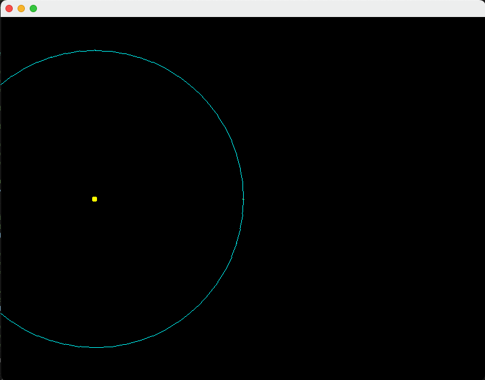
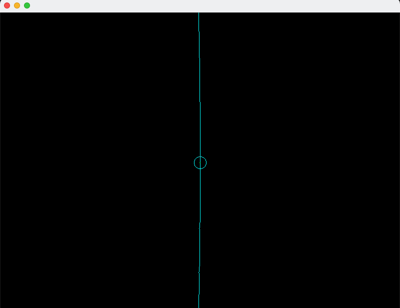
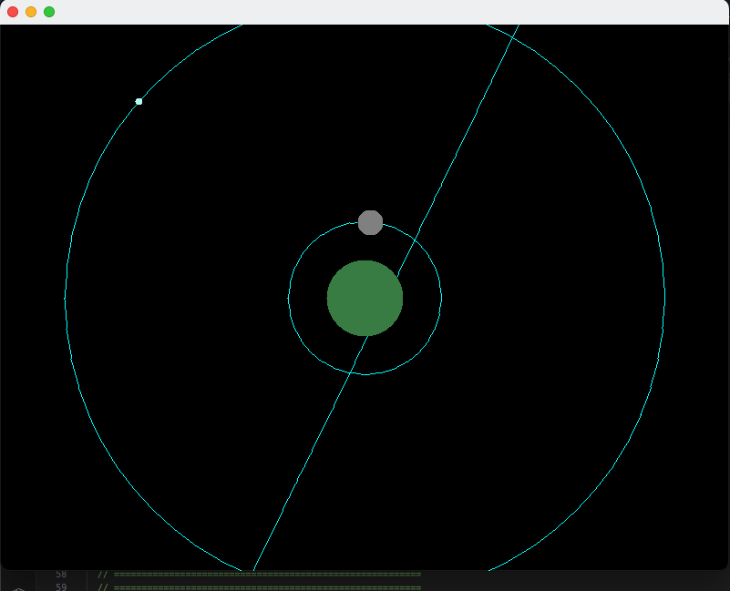
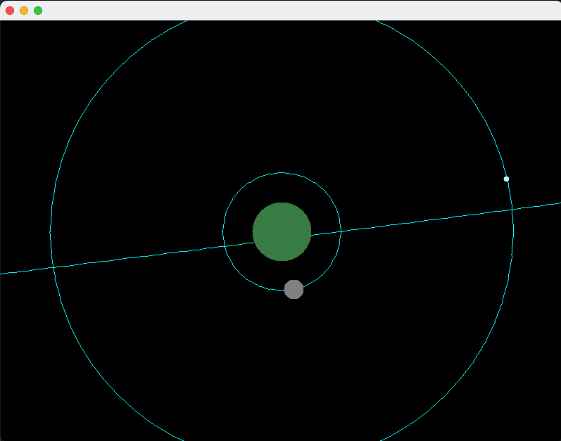

# mixed language [orrery](https://en.wikipedia.org/wiki/Orrery)
---

## quicklinks
* ~/readme/**[About](#about)**
* ~/readme/**[Status](#Status)**
* ~/readme/**[References](#references)**
<!-- aaaa do those here soon -->

---

## About
* repo is for making solar system models done in whichever language i feel like it should be in

show more

* this will inherit from the work done in
  - `scala_drawing`
  - `scala_ui_testing`
  - `cpp_isometric_grider`
  - `ProceduralCpp`
  - various other private repositories
  - various content done for university assignments
* aim is to keep things as simple as possible to create the base structure which can then be made into something more.
* as it stands (at repository creation), both starting points have already suffered massive feature creep and will be simplified to just:
  - 1 star at centre
  - planets orbit star
  - moons orbit planets
* ships/asteroids will be labeled as satellites and will be a milestone for each implementation
* everything should be kept as whichever portable drawing system is on hand easily for the given language that requires minimal starting time.
  - further modifications for UI and other features can be done once foundation is setup
  - changing drawing systems can then be treated as a new sub-project with the same language
  - care should be taken to avoid initial use of any system that requires pixel based drawing until this project has more implementations and familiarity
  - for the above point reason, `ncurses` should be secondary to `raylib`/`raygui` unless we find a function that handles circles or can use quick math to do it
* for inital plans, we'll probably stick to the `Kerbol System` from `Kerbal Space Program 1` as it's what is most familiar in mind right now
  - inspiration didnt necessarily come from this, as it has been a long time that I've wanted to create this project.
  - watching `For All Mankind` and playing a lot of `Kerbal space program 1` lately has meant that my interest was returned and so could dust off old notes and plans

---

## Implementations

### Status
<ul>
  <li></img>
    

<i>show/hide details</i>

      <ul>
        <li><code>[12/02/2024]</code> - <i>alpha with some feature creep, check todo</i></li>
        <li><code>[13/02/2024]</code> - <i>somewhat prototype</i></li>
        <li>
          

<i>show/hide todo</i>

            <ul>
              <li><code>[12/02/2024]</code> - <i>need to fill in the other planets and moons</i></li>
              <li><code>[13/02/2024]</code> - <strikethrough>changing over structure to list of orbiting satellites on a body, and those orbits hold what the thing is</strikethrough></li>
              <li><code>[13/02/2024]</code> - <strikethrough>move stage paint code to solar system painter</strikethrough></li>
              <li><code>[13/02/2024]</code> - <i>restructure window/app to be seperated out from main</i></li>
              <li><code>[13/02/2024]</code> - <strikethrough>restructure the code to allow keyboard input</strikethrough></li>
              <li><code>[13/02/2024]</code> - <i>restructure the code to allow mouse input</i></li>
              <li><code>[13/02/2024]</code> - <strikethrough>add in wasd moves system center offset around</strikethrough></li>
              <li><code>[13/02/2024]</code> - <strikethrough>add in q and e changes the zoom level of the sim</strikethrough></li>
              <li><code>[13/02/2024]</code> - <i>change over to <code>BigDecimal</code></i></li>
              <li><code>[13/02/2024]</code> - <i>status text stuff</i></li>
              <li><code>[13/02/2024]</code> - <i>details of placement of things showing (red/yellow/green based on percentage of max)</i></li>
              <li><code>[13/02/2024]</code> - <i>break circle into points of known values and work between them</i></li>
              <li><code>[13/02/2024]</code> - <i>need labels of which planet is which</i></li>
              <li><code>[13/02/2024]</code> - <i>need status of time speed</i></li>
              <li><code>[13/02/2024]</code> - <i>need status of scale</i></li>
              <li><code>[13/02/2024]</code> - <i>wikis have a decent explanation of orbits too</i></li>
              <li><code>[14/02/2024]</code> - <i>change to use unit circle points and multi with value??</i></li>
              <li><code>[14/02/2024]</code> - <i>placeholder?</i></li>
            </ul>
          

        </li>
        <li>
          

<i>show/hide changes</i>

            <ul>
              <li><code>[13/02/2024]</code> - <i>changed structure to having orbit list and each orbit holds ref to body</i></li>
              <li><code>[13/02/2024]</code> - <i>changed to name of universe to solar system</i></li>
              <li><code>[13/02/2024]</code> - <i>made the solar system painter class</i></li>
              <li><code>[13/02/2024]</code> - <i>added in stubs for keyboard input</i></li>
              <li><code>[13/02/2024]</code> - <i>added in code for updating the phase of each orbital</i></li>
              <li><code>[13/02/2024]</code> - <i>added in code for centering on a body by reference</i></li>
              <li><code>[13/02/2024]</code> - <i>added screenshots to readme</i></li>
              <li><code>[13/02/2024]</code> - <i><code>wasd</code> controls scales</i></li>
              <li><code>[13/02/2024]</code> - <i><code>f</code> cycles planet/sun focus</i></li>
              <li><code>[13/02/2024]</code> - <i>added more bodies to the system</i></li>
              <li><code>[13/02/2024]</code> - <i><code>b</code> toggles larger/smaller planet scale</i></li>
              <li><code>[13/02/2024]</code> - <i>changed scaling over in an attempt to reduce precision loss, but will need to change to <code>BigDecimal</code> to solve it</i></li>
              <li><code>[13/02/2024]</code> - <i>placeholder?</i></li>
            </ul>
          

        </li>
      </ul>
    

    

<code>12/2/2024</code> - <i>show/hide screenshots</i>

      
      
    

    

<code>12/2/2024</code> - <i>show/hide screenshots</i>

      
      
    

  </li>
  <li><i>more to come</i></li>
</ul>

---

## References
* [Orrery](https://en.wikipedia.org/wiki/Orrery)
* [solar system model](https://en.wikipedia.org/wiki/Solar_System_model)
* [Kerbol system](https://wiki.kerbalspaceprogram.com/wiki/Kerbol_System)
* [solar system](https://en.wikipedia.org/wiki/Solar_System)
* [3blue1brown linear transformations](https://www.youtube.com/watch?v=kYB8IZa5AuE&list=PLZHQObOWTQDPD3MizzM2xVFitgF8hE_ab&index=5)
  - [rotation of vectors](https://youtu.be/kYB8IZa5AuE?si=f7xmdoAd2k2IvyFF&t=509)
* [pi](https://en.wikipedia.org/wiki/Pi)
* [double precision](https://en.wikipedia.org/wiki/Double-precision_floating-point_format)
* [unit circle explainer](https://www.geogebra.org/m/DHPyZp8G)
* [unit circle rolling toy](https://www.geogebra.org/m/svXR9BB6)

---

## brainstorming
### brainstorming pre-java sub-project
<ul>
  <li><h4>original typed brainstorm <code>[8:30AM][11/02/2024]</code></h4>
  

show / hide

Have the main
Just does the applet code jpanel/jframe/paint loop, standard stuff

Then you have stage, has the universe scale and a reference for sun

The sun is a celestialBody which has things orbiting it
Those orbits are celestialBodies or ships
They have semimajor axis, eccentricities and stuff
Then you have the info about the body

Could seperate out the data from the drawn
Celestial body is now obj with its details and orbit info
Double linked? Or hands off data every draw?

Maybe it doesnt know about parent so you paint. From god view and can see the parent while painting

Painting is a depth first or bredth first? Probably bredth first

You have the objects and orbit data
You set that up and its just a store

Then you can paint using that information based on current time to find where they are now

Maybe paint is dumb and doesnt calculate at all. Just paints

Now you could thread? Or you do update before a paint cycle. Theyre seperate accesses from main/paint loop level

tick(long chronoIntervalMillis) which hands off all children as a “time elapsed” since last update

Implication is u have a repaintTimeSince and updateTimeSince
Paint is dumb and main worries about that
But update figures out how long it takes and then predicts if it can do another before the next paint cycle?

Maybe update only happens when we need to paint. So we just keep track of

microverseOriginTimestamp
lastPhysicsTimestamp
lastPaintTimestamp

If it there’s enough time since we last painted, we do a paint, but we need to ask for new context to paint so we’re not painting old content. Check buffer

What if feature creep a buffer for paintables. So the buffer is updated with pixels of what we’re painting

https://en.wikipedia.org/wiki/Astronomical_object

Namables

Star is root

Planet is can have moons

Moon is can have asteroids and ships

Asteroid is can have ships

Ships is can have nothing. Terminal point

Star can have moon/asteroid/ship

Maybe we categorise by size??

Can only have object with a classification strictly less than the parent

Becomes min heap kinda??
Maybe make rules list

Orbitals are strictly less than or equal to the parental body

Floats only when it’s strictly finite small distances otherwise it’s double

Like drawing to screen could be float

But distances are doubles

satellites instead of ships/asteroids

So structure

Main
Applet
    Stage
    Universe
    AstronomicalBody
        semimajoraxis
        orbitalperiod
        eccentricity
        angleofinclination
        angleofmajoraxis?
        Optional&lt;List&gt; orbitals
  

  </li>
  <li><h4>rounding error brainstorming <code>[4:00PM][14/02/2024]</code></h4>
try for define the different points
try for the roation of the plane with the things then matrix math
try for the points around the circle returner?
try for the get via multi methods then average??
we should polynomial it
  then we can figure out which things are adjacent/equivalent
    then switch between the forms
      like sliders between universe
      but it's sliding between the different types of things we can use until we're using one that's good
    break everything into smaller sub problems then build it back up
    break into matrices of smaller numbers then return for building it back up into big numbers all at once?
  numbers that refactor themselves
  

show / hide

  

  </li>
</ul>

